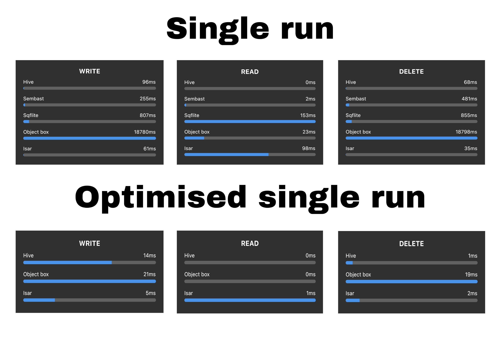

# DB Benchmarks
This project was carried out to compare [**Hive**](https://pub.dev/packages/hive) to other database options ([**Sembast**](https://pub.dev/packages/sembast), [**Sqflite**](https://pub.dev/packages/sqflite), [**Isar**](https://pub.dev/packages/isar), [**Objectbox**](https://pub.dev/packages/objectbox)). You can read the full article [**Here**](https://linktoarticle.com).

## 🚀 Benchmark Results

**Results (time in milliseconds) from 10 consecutive runs for 1000 write ✍️ operations**

| DB | t(ms) | t(ms) | t(ms) | t(ms) | t(ms) | t(ms) | t(ms) | t(ms) | t(ms) | t(ms) | Avg(ms) |
|----|-------|-------|-------|-------|-------|-------|-------|-------|-------|-------|---------|
| Isar | 68 | 73 | 68 | 68 | 71 | 69 | 73 | 69 | 68 | 70 | 69.7 |
| Hive | 86 | 85 | 97 | 93 | 91 | 87 | 83 | 90 | 91 | 100 | 90.5 |
| Sembast | 241 | 252 | 263 | 257 | 258 | 240 | 236 | 253 | 257 | 246 | 250.3 |
| Sqflite | 774 | 653 | 665 | 697 | 757 | 757 | 769 | 836 | 758 | 819 | 751.2 |
| Objectbox | 18686 | 18705 | 18806 | 18790 | 18767 | 18724 | 18763 | 18717 | 18739 | 18744 | 18744.1 |

**Results (time in milliseconds) from 10 consecutive runs for 1000 read 📖 operations**

| DB | t(ms) | t(ms) | t(ms) | t(ms) | t(ms) | t(ms) | t(ms) | t(ms) | t(ms) | t(ms) | Avg(ms) |
|----|-------|-------|-------|-------|-------|-------|-------|-------|-------|-------|---------|
| Hive | 0 | 0 | 0 | 0 | 0 | 0 | 0 | 0 | 0 | 0 | 0.0 |
| Sembast | 2 | 2 | 2 | 2 | 2 | 2 | 2 | 2 | 2 | 2 | 2.0 |
| Sqflite | 135 | 133 | 136 | 151 | 134 | 132 | 133 | 131 | 155 | 140 | 138.0 |
| Objectbox | 14  | 24 | 24 | 23  | 30 | 24 | 24  | 24 | 23 | 23  | 23.3  |
| Isar      | 103 | 99 | 98 | 116 | 99 | 98 | 111 | 98 | 98 | 108 | 102.8 |

**Results (time in milliseconds) from 10 consecutive runs for 1000 delete 🚮 operations**

| DB | t(ms) | t(ms) | t(ms) | t(ms) | t(ms) | t(ms) | t(ms) | t(ms) | t(ms) | t(ms) | Avg(ms) |
| --------- | ----- | ----- | ----- | ----- | ----- | ----- | ----- | ----- | ----- | ----- | ------- |
| Isar      | 41    | 32    | 33    | 34    | 36    | 32    | 34    | 33    | 36    | 36    | 34.7    |
| Hive      | 73    | 86    | 73    | 78    | 92    | 76    | 80    | 64    | 65    | 71    | 75.8    |
| Sembast   | 485   | 507   | 491   | 481   | 503   | 491   | 497   | 523   | 503   | 515   | 499.6   |
| Sqflite   | 733   | 750   | 743   | 741   | 748   | 743   | 749   | 754   | 842   | 830   | 763.3   |
| Objectbox | 18771 | 18784 | 18684 | 18698 | 18761 | 18680 | 18738 | 18683 | 18744 | 18739 | 18782.2 |

## 🚀 Optimised Benchmark Results
Hive, Isar and Objectbox have more optimised ways to perform CRUD operations like writing, reading or deleting multiple items at once instead of individually. Below are the results using such methods for each option.

**Resultsd(time in milliseconds) from 10 consecutive runs for writing ✍️ 1000 users to the database**

| DB | t(ms) | t(ms) | t(ms) | t(ms) | t(ms) | t(ms) | t(ms) | t(ms) | t(ms) | t(ms) | Avg(ms) |
| --------- | -- | -- | -- | -- | -- | -- | -- | -- | -- | -- | ---- |
| Isar      | 6  | 3  | 6  | 5  | 7  | 5  | 5  | 5  | 5  | 6  | 5.3  |
| Hive      | 14 | 16 | 12 | 15 | 15 | 17 | 15 | 15 | 14 | 13 | 14.6 |
| Objectbox | 20 | 19 | 23 | 18 | 19 | 23 | 20 | 20 | 19 | 20 | 20.1 |

**Results (time in milliseconds) from 10 consecutive runs for reading 📖 1000 users from the database**

| DB | t(ms) | t(ms) | t(ms) | t(ms) | t(ms) | t(ms) | t(ms) | t(ms) | t(ms) | t(ms) | Avg(ms) |
| --------- | - | - | - | - | - | - | - | - | - | - | --- |
| Hive      | 0 | 0 | 0 | 0 | 0 | 0 | 0 | 0 | 0 | 0 | 0   |
| Objectbox | 0 | 0 | 0 | 0 | 0 | 0 | 0 | 0 | 0 | 0 | 0   |
| Isar      | 1 | 0 | 1 | 1 | 0 | 1 | 1 | 1 | 1 | 1 | 0.8 |

**Results (time in milliseconds) from 10 consecutive runs for deleting 🚮 1000 users from the database**

| DB | t(ms) | t(ms) | t(ms) | t(ms) | t(ms) | t(ms) | t(ms) | t(ms) | t(ms) | t(ms) | Avg(ms) |
| --------- | -- | -- | -- | -- | -- | -- | -- | -- | -- | -- | ---- |
| Hive      | 1  | 1  | 1  | 2  | 1  | 1  | 1  | 1  | 2  | 2  | 1.3  |
| Isar      | 1  | 3  | 1  | 2  | 1  | 1  | 1  | 1  | 2  | 4  | 1.7  |
| Objectbox | 19 | 19 | 21 | 19 | 19 | 20 | 18 | 19 | 19 | 18 | 19.1 |

## 🤓 Author(s)
**Onuoha ifeanyi.** 

## 🔖 LICENCE
    Copyright 2022 Onuoha Ifeanyi

    Licensed under the Apache License, Version 2.0 (the "License");
    you may not use this file except in compliance with the License.
    You may obtain a copy of the License at

       http://www.apache.org/licenses/LICENSE-2.0

    Unless required by applicable law or agreed to in writing, software
    distributed under the License is distributed on an "AS IS" BASIS,
    WITHOUT WARRANTIES OR CONDITIONS OF ANY KIND, either express or implied.
    See the License for the specific language governing permissions and
    limitations under the License.
